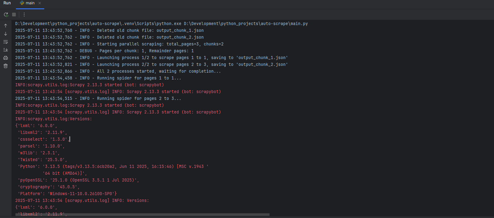

# Auto Scrape


## Description
AutoScrape — Scrapes used cars from AutoRia daily.


## Technologies Used
- Python
- Scrapy
- Selenium
- PostgreSQL
- Logging


## Features
- Daily scraping of AutoRia used cars
- Stores data in PostgreSQL
- Auto daily database dumps to dumps/ folder


## Setup
To install the project locally on your computer, execute the following commands in a terminal:
```bash
git clone https://github.com/Illya-Maznitskiy/auto-scrape.git
cd auto-scrape
python -m venv venv
venv\Scripts\activate (on Windows)
source venv/bin/activate (on macOS)
pip install -r requirements.txt
```


## Create Your Database
Make sure PostgreSQL is installed on your system.

## Steps:
1. Confirm PostgreSQL installation.
2. Open your terminal or PowerShell.
3. Connect to PostgreSQL using the `psql` command-line tool:
   ```bash
   psql -U postgres
   ```
Enter your password when prompted.
4. You should see something like this:
```
psql (17.5)
WARNING: Console code page (437) differs from Windows code page (1252)
         8-bit characters might not work correctly. See psql reference
         page "Notes for Windows users" for details.
Type "help" for help.
```
5. Create a new database called auto_scrape:
```bash
CREATE DATABASE auto_scrape;
```
6. Connect to your new database:
```bash
\c auto_scrape
````
You should see:
```
You are now connected to database "auto_scrape" as user "postgres".
```
Create the cars table with the following schema:
```bash
CREATE TABLE cars (
    id SERIAL PRIMARY KEY,
    url TEXT,
    title TEXT,
    price_usd INTEGER,
    odometer INTEGER,
    username TEXT,
    phone_number TEXT,
    image_url TEXT,
    images_count INTEGER,
    car_number TEXT,
    car_vin VARCHAR(50) UNIQUE NOT NULL,
    datetime_found TIMESTAMP
);
```


## Tests
You can run flake8 linter using the following commands:
```bash
flake8
```


## Run the project
```bash
python -m main
```


## Run the project with Docker

Make sure Docker is installed and running, then run:

```bash
docker-compose up --build
```


## Screenshots
### Logging


### Data

